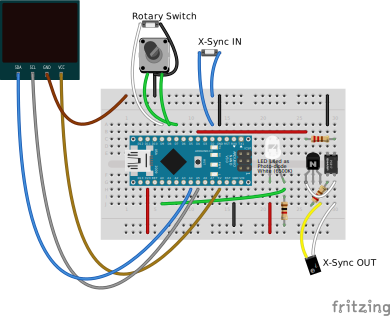
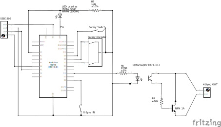

# FlashyDelaytrigger

A small Arduino nano project to measure the duration of flashes, and delay flash trigger synchronization.

**Note:** Due to memory limitations, the code is only to drive a 128 x 64 SSD1306 display if DEBUG_PRINT is disabled. There is an automatic fallfack to 128 x 32.

## Beginner Instructions

* [English](INSTRUCTIONS.md)
* [Deutsch](INSTRUCTIONS_DE.md)

